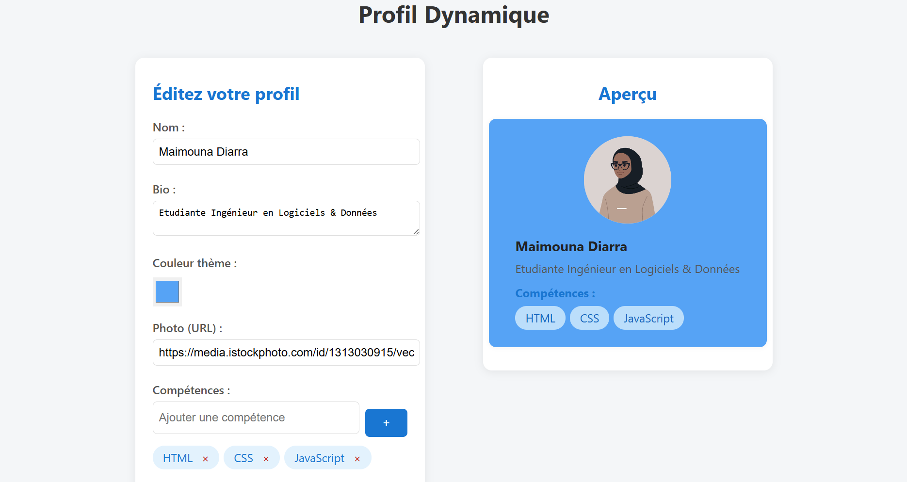

## 📘 Profil Dynamique – Projet PHP / JavaScript

### 🧩 Description

Ce projet est une **application web interactive** qui permet  à un utilisateur d’éditer et de prévisualiser son profil (nom, bio, photo, thème et compétences).
Les données sont **sauvegardées dans un fichier JSON** via une communication **JavaScript ↔ PHP** sans rechargement de page (`fetch()` API).

---

### ⚙️ Fonctionnalités principales

* 🖋️ Formulaire dynamique (nom, bio, photo, couleur, compétences)
* 👀 Prévisualisation en temps réel du profil avec DOM & événements
* 🎨 Thème personnalisable (couleur de fond en direct)
* ➕ Ajout et suppression de compétences avec mise à jour instantanée
* 💾 Sauvegarde asynchrone vers `data.json` (AJAX / fetch + PHP)
* ✅ Validation des champs côté PHP
* 📂 Persistance des profils dans un fichier `data.json`

---

### 🛠️ Technologies utilisées

* **Frontend** : HTML5, CSS3, JavaScript (DOM, fetch)
* **Backend** : PHP 8
* **Format de données** : JSON

---

### 🧠 Objectifs pédagogiques

* Comprendre la communication **front-end / back-end**
* Manipuler le **DOM** et les **événements**
* Gérer des requêtes **asynchrones avec `fetch()`**
* Sauvegarder et manipuler des données **au format JSON**
* Construire une mini application web **full-stack**

---

### 🚀 Installation et utilisation

1. Place le projet dans le dossier `www` (WAMP) ou `htdocs` (XAMPP)
2. Lance le serveur local :

   ```bash
   php -S localhost:8000
   ```
3. Ouvre [http://localhost:8000/index.html](http://localhost:8000/index.html)
4. Remplis le formulaire et clique sur **Sauvegarder**
5. Vérifie les entrées dans `data.json`

---

### 📸 Aperçu


---

### 🧑‍💻 Auteur

**Maimouna Diarra**
Étudiante ingénieure – Spécialisation Logiciels & Données (ESEO)
📍 Projet personnel d’apprentissage Full Stack (PHP / JS)

---


